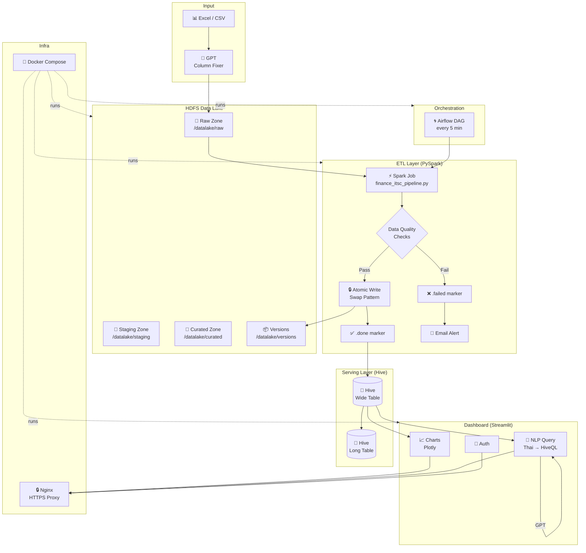
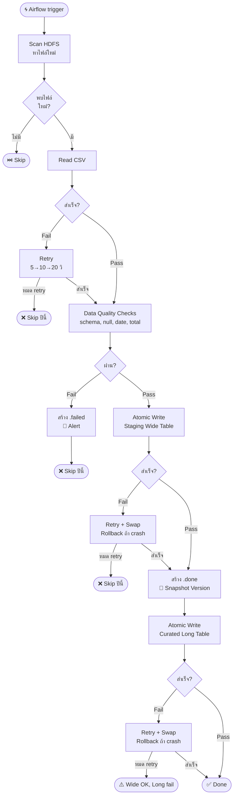
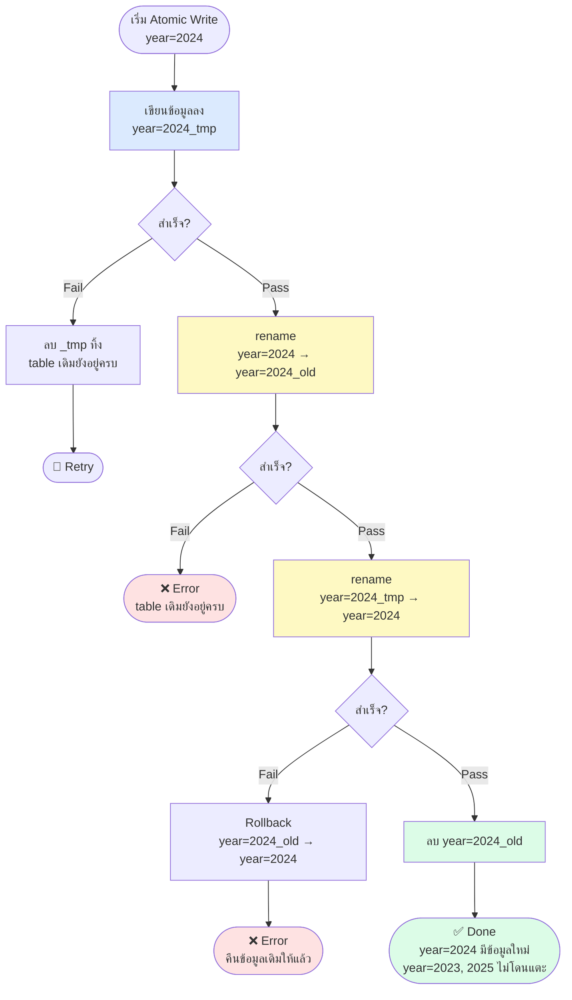

[](https://github.com/Qaizx/hadoop-data-pipeline/actions/workflows/ci.yml)

# Finance ITSC Dashboard

ระบบ Data Lake และ Dashboard สำหรับวิเคราะห์งบประมาณ ITSC มหาวิทยาลัยเชียงใหม่

## Architecture



**Stack**
- **Data Lake**: Hadoop HDFS + Hive Metastore
- **ETL**: Apache Spark (PySpark)
- **Orchestration**: Apache Airflow
- **Dashboard**: Streamlit + Plotly
- **NLP**: OpenAI GPT → HiveQL
- **Proxy**: Nginx (HTTPS)

## Project Structure

```
HADOOP_NEW/
├── airflow/
│   ├── dags/               # Airflow DAGs
│   └── Dockerfile.airflow
├── dashboard/
│   ├── components/         # Streamlit UI components
│   ├── services/           # Hive + GPT integration
│   ├── utils/              # History, helpers
│   ├── app.py              # Entry point
│   ├── auth.py             # Authentication
│   └── config.py           # Table schema, category mapping
├── jobs/
│   ├── finance_itsc_pipeline.py   # Spark ETL entry point
│   ├── data_quality.py            # Data Quality checks
│   ├── logger.py                  # Structured logging (loguru)
│   └── utils/
│       ├── hdfs.py                # HDFS helpers
│       ├── alerts.py              # Email alerts
│       ├── retry.py               # Retry + Atomic write
│       └── versioning.py          # Data versioning / rollback
├── tests/                  # Unit tests (pytest)
├── docs/
│   └── versioning.md       # คู่มือ versioning และ rollback
├── certs/                  # SSL certificates (ไม่ commit)
├── data/                   # Raw data files (ไม่ commit)
├── docker-compose.yaml
├── nginx.conf
└── .env                    # ไม่ commit — ดู .env.example
```

## Prerequisites

- Docker + Docker Compose
- OpenAI API Key
- Gmail App Password (สำหรับ email alerts)

## Setup

**1. Clone และตั้งค่า environment**
```bash
git clone <repo-url>
cd HADOOP_NEW
cp .env.example .env
# แก้ไข .env ใส่ค่าจริง
```

**2. สร้าง SSL Certificate**
```bash
# Windows (Git Bash)
bash generate_cert.sh

# Linux/Mac
openssl req -x509 -nodes -days 365 -newkey rsa:2048 \
    -keyout certs/server.key \
    -out certs/server.crt \
    -subj "/C=TH/ST=ChiangMai/O=ITSC-CMU/CN=localhost"
```

**3. สร้าง config.py จาก example**
```bash
cp dashboard/config.py.example dashboard/config.py
# แก้ไข config.py ตามต้องการ
```

**4. รัน Docker Compose**
```bash
docker compose up -d
```

**5. ตั้งค่า Airflow**
```bash
# เข้า Airflow UI: http://localhost:8088
# Admin → Variables → เพิ่ม:
#   Key: alert_email
#   Value: your-email@gmail.com
```

**6. Upload ข้อมูลเข้า HDFS**
```bash
# สร้าง directory structure
docker exec namenode hdfs dfs -mkdir -p /datalake/raw/finance-itsc/year=2024

# Upload CSV
docker exec -i namenode hdfs dfs -put /data/finance_itsc_2024.csv \
    /datalake/raw/finance-itsc/year=2024/
```

## Environment Variables

ตั้งค่าใน `.env`:

| Variable | Default | Description |
|----------|---------|-------------|
| `ETL_MAX_RETRIES` | `3` | จำนวนครั้ง retry เมื่อ step fail |
| `ETL_RETRY_DELAY` | `5` | วินาทีรอก่อน retry (x2 ทุกรอบ) |
| `KEEP_VERSIONS` | `5` | จำนวน version ที่เก็บต่อปี |
| `LOG_DIR` | `/jobs/logs` | path สำหรับเก็บ log files |

## Services

| Service | URL | หมายเหตุ |
|---------|-----|---------|
| Dashboard | https://localhost | หน้าหลัก |
| Airflow | http://localhost:8088 | Pipeline management |
| Spark Master | http://localhost:8080 | หรือ https://localhost/spark/ |
| HDFS NameNode | http://localhost:9870 | |
| Hive Server | localhost:10000 | JDBC |

## ETL Pipeline

Pipeline รันอัตโนมัติทุก 5 นาที ผ่าน Airflow DAG `finance_etl_pipeline`



ทุก step มี retry อัตโนมัติพร้อม exponential backoff (5 → 10 → 20 วินาที)

**Marker files:**
- `filename.csv.done` — processed สำเร็จ
- `filename.csv.failed` — Data Quality failed (ต้องแก้ไขก่อน retry)

## Data Quality Checks

| Check | ระดับ | รายละเอียด |
|-------|-------|-----------|
| Schema | Fatal | Column ครบ 32 อัน |
| Null Values | Fatal | date, details ห้าม null |
| Date Format | Fatal | ต้องมี all-year-budget, total spent, remaining |
| Total Amount | Warning | total_amount ≈ sum ทุก column (±1%) |
| Remaining | Warning | remaining ต้องลดหลั่งทุกเดือน |

## Atomic Write & Retry

ป้องกัน partial data เข้า Hive table ด้วย **swap pattern** — เขียนแยก partition เฉพาะปีที่ process ปีอื่นไม่โดนแตะ



## Data Versioning

ทุกครั้งที่ ETL สำเร็จจะสร้าง snapshot อัตโนมัติ เก็บไว้ **5 version ล่าสุด** ต่อปี

**ดู versions ทั้งหมด:**
```python
from utils.versioning import list_versions
versions = list_versions(sc, year=2024)
for v in versions:
    print(f"{v['version']} | {v['timestamp']} | rows={v['row_count']}")
```

**Rollback ไป version เก่า:**
```python
from utils.versioning import restore_version
restore_version(
    spark,
    version_id="v_20260215_090000",
    year=2024,
    target_table="finance_itsc_wide",
    target_path="hdfs://namenode:8020/datalake/staging/finance-itsc_wide",
)
```

ดูรายละเอียดเพิ่มเติมได้ที่ [docs/versioning.md](docs/versioning.md)

## Running Tests

```bash
# รัน test ทั้งหมด
pytest tests/ -v

# รัน test เฉพาะ module
pytest tests/test_atomic_write.py -v
pytest tests/test_versioning.py -v
```

**Test coverage:**

| Test file | ทดสอบอะไร |
|-----------|-----------|
| `test_atomic_write.py` | Swap pattern, retry, rollback, ปีอื่นไม่โดนแตะ |
| `test_versioning.py` | Create snapshot, list versions, cleanup, restore |

## Troubleshooting

**Spark ใช้ Python ผิด version**
```bash
# ตรวจสอบ PYSPARK_PYTHON ใน docker-compose.yaml
- PYSPARK_PYTHON=python3
- PYSPARK_DRIVER_PYTHON=python3
```

**Hive reserved keyword error**
```
Pipeline จะ auto-fix `date` → `\`date\`` อัตโนมัติ
```

**HDFS ไม่ขึ้น**
```bash
docker compose restart namenode datanode
```

**Dashboard ไม่อัพเดทหลังแก้โค้ด**
```bash
docker compose restart streamlit-dashboard
```

**ดู logs ของ ETL pipeline**
```bash
# log ทั้งหมด
docker exec spark-master cat /jobs/logs/etl.log

# เฉพาะ error
docker exec spark-master cat /jobs/logs/etl.error.log
```